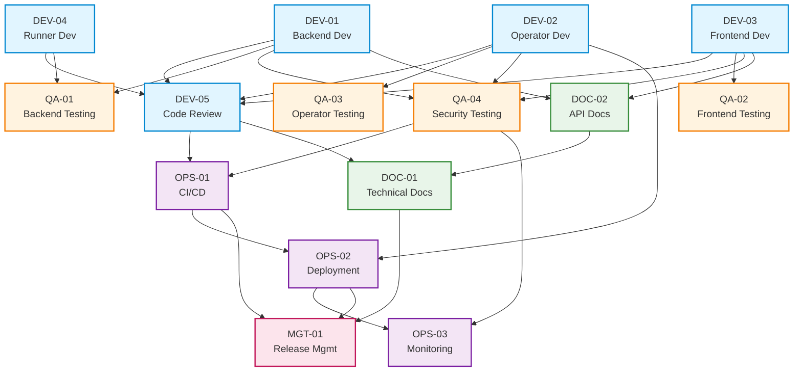
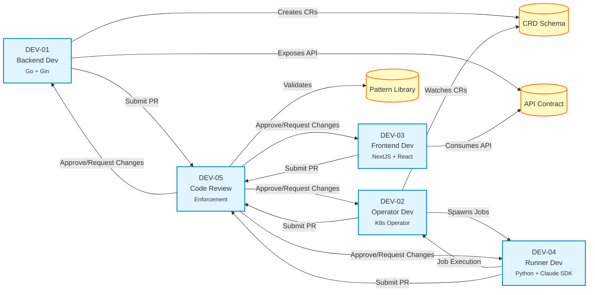
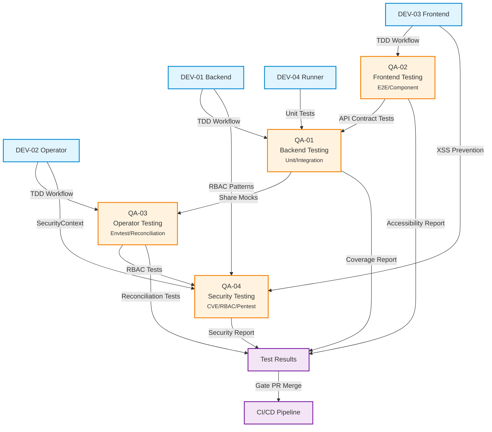
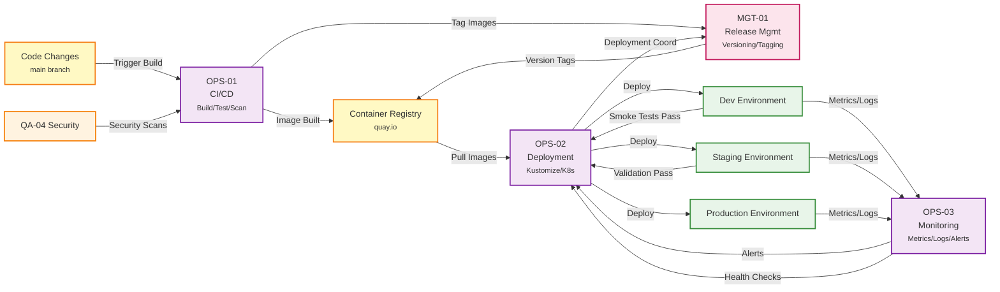
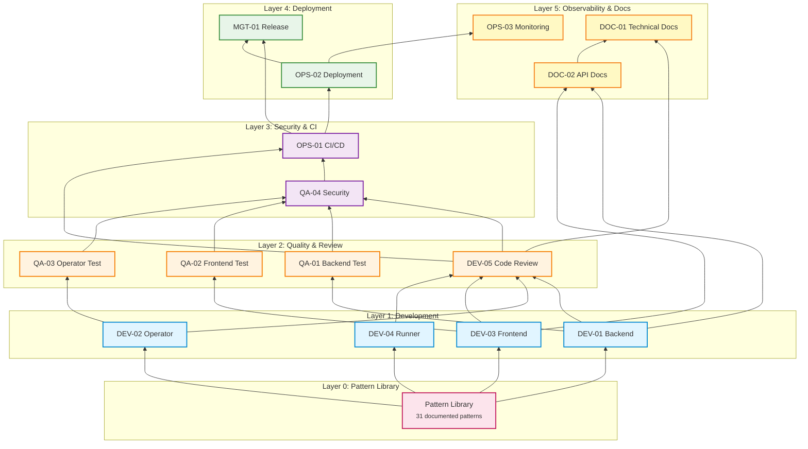

# Agent Relationships and Integration Points

This document provides Mermaid diagrams visualizing the relationships between agents in the SDLC framework.

## Table of Contents

1. [Complete Agent Network](#complete-agent-network)
2. [Development Agents Flow](#development-agents-flow)
3. [Quality Assurance Flow](#quality-assurance-flow)
4. [Operations Flow](#operations-flow)
5. [Documentation Flow](#documentation-flow)
6. [Integration Points Matrix](#integration-points-matrix)

---

## Complete Agent Network

High-level view of all 15 agents and their primary integration points.



---

## Development Agents Flow

Detailed view of development agent interactions and code review workflow.



---

## Quality Assurance Flow

Test coverage and security validation workflow.



---

## Operations Flow

CI/CD, deployment, and monitoring pipeline.



---

## Documentation Flow

Documentation creation, maintenance, and synchronization.

```mermaid
graph TD
    %% Development Agents (sources)
    DEV01[DEV-01 Backend]
    DEV02[DEV-02 Operator]
    DEV03[DEV-03 Frontend]
    DEV05[DEV-05 Code Review]

    %% Doc Agents
    DOC01[DOC-01<br/>Technical Docs<br/><small>CLAUDE.md/MkDocs</small>]
    DOC02[DOC-02<br/>API Docs<br/><small>OpenAPI/Swagger</small>]

    %% Doc Sources
    CODE[Source Code]
    PATTERNS[Pattern Library<br/><small>31 patterns</small>]
    CLAUDE[CLAUDE.md<br/><small>Standards</small>]

    %% Documentation Flow
    CODE -->|Extract Patterns| PATTERNS
    PATTERNS -->|Document| DOC01
    DEV05 -->|Validate Sync| DOC01

    DEV01 -->|API Implementation| DOC02
    DEV03 -->|API Consumption| DOC02

    DOC01 -->|Maintains| CLAUDE
    DOC01 -->|Maintains| MKDOCS[MkDocs Site]
    DOC01 -->|Maintains| README[Component READMEs]

    DOC02 -->|Generates| OPENAPI[OpenAPI Spec]
    DOC02 -->|Generates| SWAGGER[Swagger UI]
    DOC02 -->|Generates| POSTMAN[Postman Collection]

    %% Outputs
    MKDOCS -->|Publishes| DOCS_SITE[docs.ambient-code.io]
    SWAGGER -->|Serves| API_DOCS[/api/docs]

    %% Synchronization
    DOC01 -.->|References| DOC02
    DOC02 -.->|Embedded In| MKDOCS

    %% Styling
    classDef devClass fill:#e1f5ff,stroke:#0288d1,stroke-width:2px
    classDef docClass fill:#e8f5e9,stroke:#388e3c,stroke-width:2px
    classDef outputClass fill:#fff9c4,stroke:#f57f17,stroke-width:2px

    class DEV01,DEV02,DEV03,DEV05 devClass
    class DOC01,DOC02 docClass
    class PATTERNS,CLAUDE,MKDOCS,README,OPENAPI,SWAGGER,POSTMAN,DOCS_SITE,API_DOCS,CODE outputClass
```

---

## Integration Points Matrix

Tabular view of which agents integrate with each other.

| From/To  | DEV-01 | DEV-02 | DEV-03 | DEV-04 | DEV-05 | QA-01 | QA-02 | QA-03 | QA-04 | OPS-01 | OPS-02 | OPS-03 | DOC-01 | DOC-02 | MGT-01 |
|----------|:------:|:------:|:------:|:------:|:------:|:-----:|:-----:|:-----:|:-----:|:------:|:------:|:------:|:------:|:------:|:------:|
| **DEV-01** | - | ✓ | ✓ | - | ✓ | ✓ | - | - | ✓ | - | - | - | - | ✓ | - |
| **DEV-02** | ✓ | - | - | ✓ | ✓ | - | - | ✓ | ✓ | - | ✓ | - | - | - | - |
| **DEV-03** | ✓ | - | - | - | ✓ | - | ✓ | - | ✓ | - | - | - | - | ✓ | - |
| **DEV-04** | - | ✓ | - | - | ✓ | ✓ | - | - | - | - | - | - | - | - | - |
| **DEV-05** | ✓ | ✓ | ✓ | ✓ | - | - | - | - | ✓ | ✓ | - | - | ✓ | - | - |
| **QA-01** | ✓ | - | - | ✓ | - | - | - | - | ✓ | - | - | - | - | - | - |
| **QA-02** | - | - | ✓ | - | - | - | - | - | ✓ | - | - | - | - | - | - |
| **QA-03** | - | ✓ | - | - | - | - | - | - | ✓ | - | - | - | - | - | - |
| **QA-04** | ✓ | ✓ | ✓ | - | ✓ | ✓ | ✓ | ✓ | - | ✓ | - | ✓ | - | - | - |
| **OPS-01** | - | - | - | - | ✓ | - | - | - | ✓ | - | ✓ | - | - | - | ✓ |
| **OPS-02** | - | ✓ | - | - | - | - | - | - | - | ✓ | - | ✓ | - | - | ✓ |
| **OPS-03** | - | - | - | - | - | - | - | - | ✓ | - | ✓ | - | - | - | - |
| **DOC-01** | - | - | - | - | ✓ | - | - | - | - | - | - | - | - | ✓ | - |
| **DOC-02** | ✓ | - | ✓ | - | - | - | - | - | - | - | - | - | ✓ | - | - |
| **MGT-01** | - | - | - | - | - | - | - | - | - | ✓ | ✓ | - | ✓ | - | - |

**Legend:**
- ✓ = Direct integration point (agents coordinate on specific tasks)
- Empty = No direct integration

### Integration Type Summary

- **Development ↔ Testing**: TDD workflow, test coverage
- **Development ↔ Security**: Pattern enforcement, vulnerability prevention
- **Development ↔ Docs**: API contracts, pattern documentation
- **Testing ↔ Security**: RBAC validation, security test coordination
- **CI/CD ↔ Deployment**: Image builds, staged rollouts
- **Deployment ↔ Monitoring**: Health checks, metrics collection
- **Release ↔ Ops**: Version tagging, deployment coordination

---

## Agent Dependency Layers

Agents organized by execution order (bottom-up dependency).



---

## Usage

These diagrams can be embedded in MkDocs or viewed directly in GitHub. To update diagrams:

1. Edit this file
2. Validate Mermaid syntax: `npx @mermaid-js/mermaid-cli validate AGENT_RELATIONSHIPS.md`
3. Regenerate static diagrams if needed: `npx @mermaid-js/mermaid-cli -i AGENT_RELATIONSHIPS.md`
4. Commit changes

For live preview, use MkDocs with mermaid2 extension or paste into https://mermaid.live
