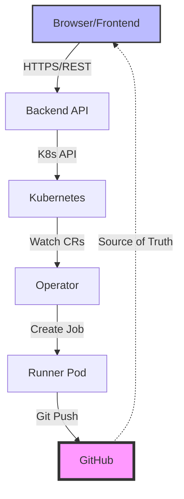
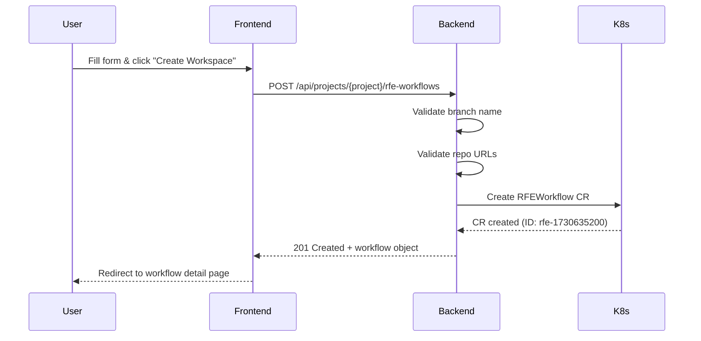
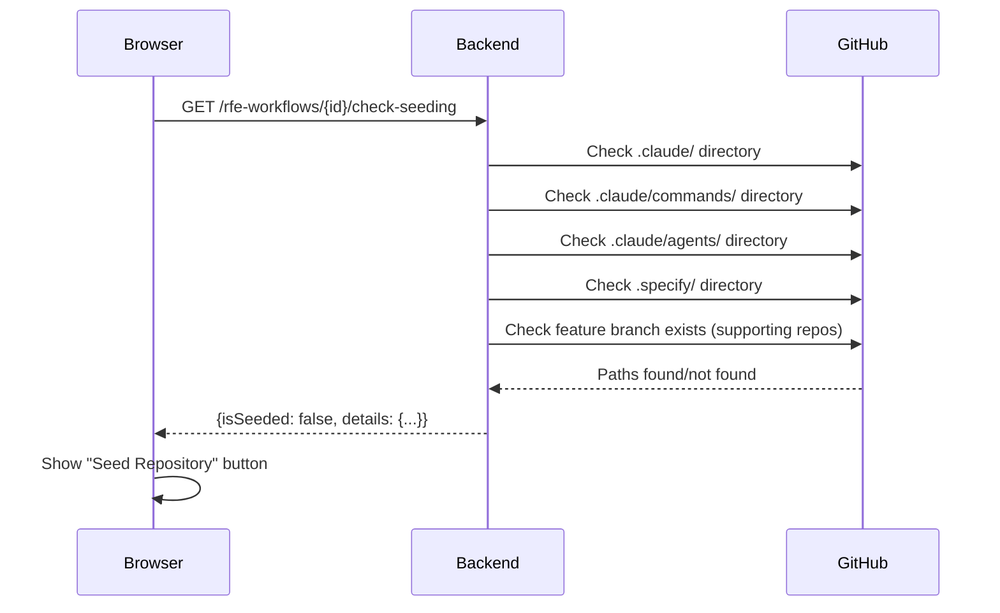
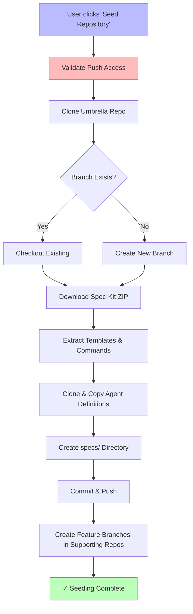
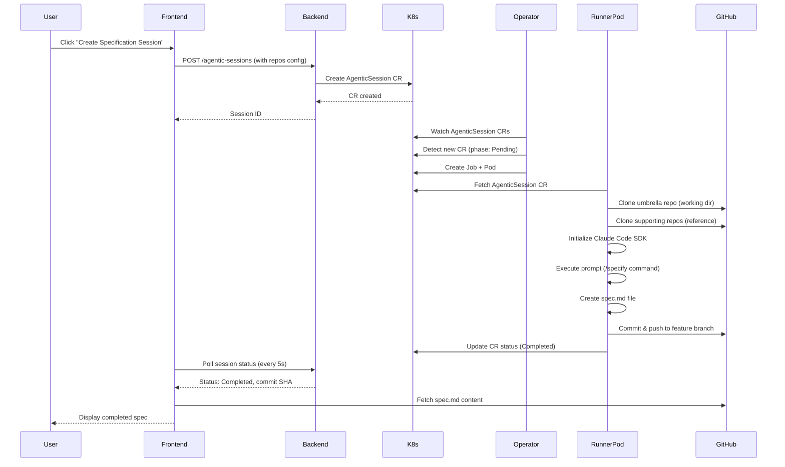
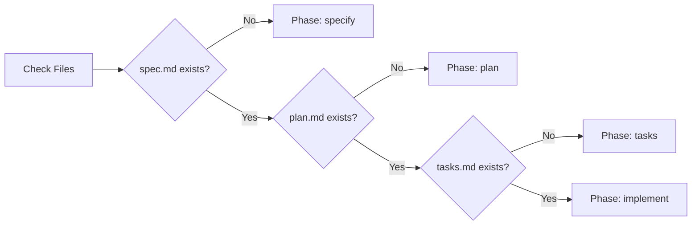
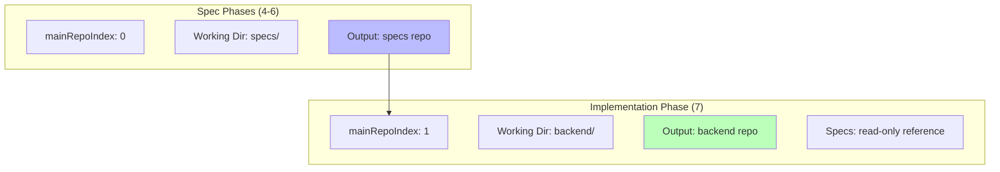
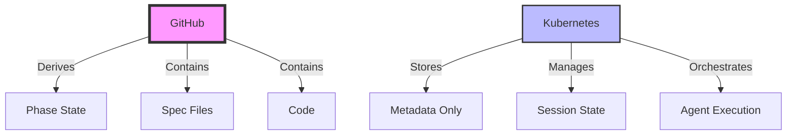

# RFE Workflow: What Happens When You Hit Enter

**A Developer's Guide to the Ambient Code Platform (ACP) Guided RFE Workspace Process**

This document provides a phase-by-phase breakdown of what happens behind the scenes when you work with RFE (Request For Enhancement) workflows in the Ambient Code Platform. For each "enter" moment, we'll trace the complete journey from your browser through the API, Kubernetes, GitHub, and back.

---

## Table of Contents

- [Architecture Overview](#architecture-overview)
- [Phase 1: Create RFE Workspace](#phase-1-create-rfe-workspace)
- [Phase 2: Check Seeding Status](#phase-2-check-seeding-status)
- [Phase 3: Seed Repository](#phase-3-seed-repository)
- [Phase 4-6: Specification Development](#phase-4-6-specification-development)
- [Phase 7: Implementation](#phase-7-implementation)
- [Data Storage Locations](#data-storage-locations)
- [Key Architecture Insights](#key-architecture-insights)

---

## Architecture Overview

The RFE workflow is **git-native and spec-driven**, using GitHub as the single source of truth rather than maintaining internal workspace state.

### Core Components Flow



**Key Difference from Standard Sessions**:
- **RFE Workflows**: No dedicated operator, git-native, phase-based, multi-repo support
- **Standard Sessions**: Operator creates pods, PVC workspace, single execution

---

## Phase 1: Create RFE Workspace

### User Action Flow



### API Request

```http
POST /api/projects/my-project/rfe-workflows
Authorization: Bearer {your-token}
Content-Type: application/json

{
  "title": "User Authentication System",
  "description": "Implement JWT-based authentication with OAuth2 integration...",
  "branchName": "ambient-user-authentication",
  "umbrellaRepo": {
    "url": "https://github.com/myorg/specs",
    "branch": "main"
  },
  "supportingRepos": [
    {
      "url": "https://github.com/myorg/backend",
      "branch": "main"
    }
  ],
  "parentOutcome": "RHASTRAT-456"
}
```

### Backend Processing

**Handler**: [`CreateProjectRFEWorkflow`](https://github.com/ambient-code/vTeam/blob/main/components/backend/handlers/rfe.go#L142-L189)

**Key Operations**:
1. **Authenticate User** ([L181](https://github.com/ambient-code/vTeam/blob/main/components/backend/handlers/rfe.go#L181)) - Uses `GetK8sClientsForRequest(c)` with user's token
2. **Validate Branch** ([L157-161](https://github.com/ambient-code/vTeam/blob/main/components/backend/handlers/rfe.go#L157-L161)) - Ensures not `main`, `master`, or `develop`
3. **Validate Repos** ([L164-167](https://github.com/ambient-code/vTeam/blob/main/components/backend/handlers/rfe.go#L164-L167)) - Checks for duplicate URLs via `validateUniqueRepositories`
4. **Generate ID** ([L152](https://github.com/ambient-code/vTeam/blob/main/components/backend/handlers/rfe.go#L152)) - Format: `rfe-{unix-timestamp}`
5. **Create CR** ([L182](https://github.com/ambient-code/vTeam/blob/main/components/backend/handlers/rfe.go#L182)) - Uses backend service account

### Data Storage

| Location | Data | Notes |
|----------|------|-------|
| 💾 **Kubernetes etcd** | RFEWorkflow CR | Metadata only, no files yet |
| 🐙 **GitHub** | *(none)* | No branches or commits yet |
| 💻 **Browser** | Cached workflow object | React Query cache (5min TTL) |

---

## Phase 2: Check Seeding Status

### Check Flow



### API Request

```http
GET /api/projects/my-project/rfe-workflows/rfe-1730635200/check-seeding
Authorization: Bearer {your-token}
```

### Backend Processing

**Handler**: [`CheckProjectRFEWorkflowSeeding`](https://github.com/ambient-code/vTeam/blob/main/components/backend/handlers/rfe.go#L424-L517)

**Checks**:
- `.claude/` directory exists
- `.claude/commands/` directory exists (spec-kit commands)
- `.claude/agents/` directory exists (agent definitions)
- `.specify/` directory exists (templates, scripts)
- Feature branch exists in all supporting repos

### Data Storage

No persistent storage - ephemeral status check via GitHub API

---

## Phase 3: Seed Repository

**This is the most complex operation**, performing direct Git operations on multiple repositories.

### Seeding Flow



### API Request

```http
POST /api/projects/my-project/rfe-workflows/rfe-1730635200/seed
Authorization: Bearer {your-token}
Content-Type: application/json

{
  "agentSourceUrl": "https://github.com/ambient-code/vTeam",
  "agentSourceBranch": "main",
  "agentSourcePath": "agents",
  "specKitRepo": "github/spec-kit",
  "specKitVersion": "main",
  "specKitTemplate": "spec-kit-template-claude-sh"
}
```

### Backend Processing

**Handler**: [`SeedProjectRFEWorkflow`](https://github.com/ambient-code/vTeam/blob/main/components/backend/handlers/rfe.go#L300-L421)
**Core Logic**: [`PerformRepoSeeding`](https://github.com/ambient-code/vTeam/blob/main/components/backend/git/operations.go#L295-L648)

**Operations** (runs on backend server, NOT in pod):

1. **Pre-Flight Validation** ([L308-323](https://github.com/ambient-code/vTeam/blob/main/components/backend/git/operations.go#L308-L323))
   - Validates push access via GitHub API: `GET /repos/{owner}/{repo}/collaborators/{user}/permission`

2. **Clone Umbrella Repo** ([L325-364](https://github.com/ambient-code/vTeam/blob/main/components/backend/git/operations.go#L325-L364))
   - Creates temp directory: `/tmp/umbrella-rfe-{id}-{random}`
   - Shallow clone: `git clone --depth 1 --branch {base} {url}`

3. **Feature Branch** ([L376-416](https://github.com/ambient-code/vTeam/blob/main/components/backend/git/operations.go#L376-L416))
   - If exists: `git fetch && git checkout {branch}`
   - If not: `git checkout -b {branch}`

4. **Spec-Kit Setup** ([L418-547](https://github.com/ambient-code/vTeam/blob/main/components/backend/git/operations.go#L418-L547))
   - Downloads ZIP from GitHub releases or branch archive
   - Extracts: `templates/commands/*.md` → `.claude/commands/`
   - Extracts: `scripts/bash/*` → `.specify/scripts/bash/`
   - Sets permissions: Scripts=`0755`, Files=`0644`

5. **Agent Definitions** ([L549-596](https://github.com/ambient-code/vTeam/blob/main/components/backend/git/operations.go#L549-L596))
   - Clones agent source repo
   - Copies `agents/*.md` → `.claude/agents/`

6. **Commit & Push** ([L605-632](https://github.com/ambient-code/vTeam/blob/main/components/backend/git/operations.go#L605-L632))
   - `git add .`
   - `git commit -m "chore: initialize {branch} with spec-kit and agents"`
   - `git push -u origin {branch}`

7. **Supporting Repos** ([L634-645](https://github.com/ambient-code/vTeam/blob/main/components/backend/git/operations.go#L634-L645))
   - For each repo: Clone, create feature branch, push (no spec-kit)

### Data Storage After Seeding

| Location | Data | Notes |
|----------|------|-------|
| 🐙 **GitHub (specs repo)** | Feature branch | `.claude/`, `.specify/`, `specs/{branch}/` |
| 🐙 **GitHub (supporting repos)** | Feature branch | Empty branch from base |
| 💻 **Backend Server** | *(temp dirs deleted)* | `/tmp/umbrella-*`, `/tmp/agents-*` cleaned up |

---

## Phase 4-6: Specification Development

**Phases**: Specify (spec.md) → Plan (plan.md) → Tasks (tasks.md)

### Agent Execution Flow



### API Request (Create Session)

```http
POST /api/projects/my-project/agentic-sessions
Authorization: Bearer {your-token}
Content-Type: application/json

{
  "prompt": "Create a detailed specification using /specify command...",
  "repos": [
    {
      "input": {"url": "github.com/myorg/specs", "branch": "ambient-user-authentication"},
      "output": {"url": "github.com/myorg/specs", "targetBranch": "ambient-user-authentication", "autoCommit": true}
    }
  ],
  "mainRepoIndex": 0,
  "model": "claude-sonnet-4-5",
  "timeout": 1800,
  "metadata": {
    "rfeWorkflow": "rfe-1730635200",
    "rfePhase": "specify"
  }
}
```

### Backend Processing

**Session Creation**: [`CreateSession`](https://github.com/ambient-code/vTeam/blob/main/components/backend/handlers/sessions.go#L153-L490)

**Key Steps**:
1. Authenticate user with `GetK8sClientsForRequest`
2. Validate multi-repo configuration via `ValidateRepoConfigs`
3. Generate session ID
4. Create AgenticSession CR (uses backend service account)

### Operator Processing

**Watch Handler**: [`sessions.go`](https://github.com/ambient-code/vTeam/blob/main/components/operator/internal/handlers/sessions.go)

**Operations**:
- Watches for CRs with `phase: "Pending"`
- Creates Kubernetes Job with runner pod
- Sets ownerReferences for automatic cleanup

### Inside Runner Pod

**Main Script**: [`__main__.py`](https://github.com/ambient-code/vTeam/blob/main/components/runners/claude-code-runner/claude_code_runner/__main__.py)

**Execution**:
1. Fetch AgenticSession CR from K8s API
2. Clone all repos to `/workspace/`
3. Initialize Claude Code SDK with working directory
4. Execute prompt - Claude Code:
   - Discovers slash commands from `.claude/commands/`
   - Runs `/specify`, `/plan`, or `/tasks` command
   - Creates spec.md, plan.md, or tasks.md
5. Auto-commit and push to GitHub (if `autoCommit: true`)
6. Update CR status with results and commit SHA

### Phase Progression

Frontend determines current phase by checking GitHub file existence:



**Summary Endpoint**: [`GetProjectRFEWorkflowSummary`](https://github.com/ambient-code/vTeam/blob/main/components/backend/handlers/rfe.go#L584-L704) checks GitHub for spec files

### Data Storage After Each Phase

| Location | Data | Notes |
|----------|------|-------|
| 💾 **Kubernetes etcd** | AgenticSession CR | Status: Completed, includes commit SHA |
| 🐙 **GitHub (specs repo)** | spec.md / plan.md / tasks.md | New commits on feature branch |
| 💻 **Pod Workspace** | *(deleted)* | PVC cleaned up after job completion |

---

## Phase 7: Implementation

**Goal**: Write code in supporting repos based on tasks.md

### Key Difference: Working Directory Changes



### API Request (Implementation Session)

```http
POST /api/projects/my-project/agentic-sessions

{
  "prompt": "Implement Task 1: Database Schema from tasks.md...",
  "repos": [
    {
      "input": {"url": "github.com/myorg/specs", "branch": "ambient-user-authentication"}
      // No output - read-only
    },
    {
      "input": {"url": "github.com/myorg/backend", "branch": "ambient-user-authentication"},
      "output": {"url": "github.com/myorg/backend", "targetBranch": "ambient-user-authentication", "autoCommit": true}
    }
  ],
  "mainRepoIndex": 1,  // Backend repo is working directory
  "metadata": {
    "rfeWorkflow": "rfe-1730635200",
    "rfePhase": "implement"
  }
}
```

### Runner Pod Execution

**Filesystem Layout**:
```
/workspace/
├── specs/                    # Read-only reference
│   └── specs/ambient-user-authentication/
│       ├── spec.md          # Claude reads for context
│       ├── plan.md          # Claude reads for context
│       └── tasks.md         # Claude reads for requirements
│
└── backend/                  # Working directory
    ├── migrations/          # Claude writes here
    ├── src/models/          # Claude writes here
    └── tests/               # Claude writes here
```

**Claude Code**:
1. Reads `tasks.md` for requirements
2. Reads `spec.md` for design details
3. Creates migration files, models, tests
4. Commits to backend repo: `feat: implement database schema for authentication`

### Data Storage

| Location | Data | Notes |
|----------|------|-------|
| 🐙 **GitHub (backend repo)** | Implementation code | Multiple commits as tasks completed |
| 🐙 **GitHub (specs repo)** | *(unchanged)* | No modifications in this phase |

---

## Data Storage Locations

### Complete Storage Matrix

| Storage | What's Stored | Lifecycle |
|---------|---------------|-----------|
| 💾 **Kubernetes etcd** | RFEWorkflow CR (metadata) | Persists until manually deleted |
| 💾 **Kubernetes etcd** | AgenticSession CRs | Persists until manually deleted |
| 💾 **Kubernetes etcd** | Jobs (runner execution) | Auto-deleted after completion |
| 💾 **Kubernetes etcd** | PVCs (workspace volumes) | Auto-deleted with job |
| 🐙 **GitHub (specs repo)** | Feature branch + spec files | Merged via PR |
| 🐙 **GitHub (supporting repos)** | Feature branch + code | Merged via PR |
| 💻 **Backend Server** | Temp dirs during seeding | Deleted immediately after seed |
| 💻 **Runner Pod** | Cloned repos | Deleted when pod terminates |
| 💻 **Browser** | React Query cache | 5-minute TTL |

---

## Key Architecture Insights

### 1. Git is the Source of Truth



**Not in Kubernetes**: Spec files, code, phase state (derived)
**Only in Kubernetes**: Workflow metadata, session execution state, labels

### 2. No RFE-Specific Operator

RFE workflows **reuse** the standard AgenticSession operator. Linking via labels:
- `rfe-workflow=rfe-1730635200`
- `rfe-phase=specify|plan|tasks|implement|review`

### 3. Branch-Centric Workflow

All repos use the **same feature branch name** (e.g., `ambient-user-authentication`). This makes cross-repo changes easy to track.

### 4. Multi-Repo Support

- **Umbrella repo**: Contains specs, agents, spec-kit
- **Supporting repos**: Implementation code
- **mainRepoIndex**: Determines working directory (0=specs, 1=backend)

### 5. Permission Model

- **Seeding**: User's GitHub token (requires push access)
- **Session execution**: User's token OR project `GIT_TOKEN` secret
- **CR writes**: Backend service account (elevated)
- **CR reads**: User's Kubernetes token

---

## Common Questions

### Q: Can I work on multiple tasks in parallel?

**A**: Yes! Create multiple AgenticSessions with the same `rfe-workflow` label. They'll run in separate pods and commit to the same feature branch.

### Q: What happens if seeding fails midway?

**A**: The operation is **not atomic**. If partial seeding occurs, you can re-run to complete. The feature branch remains but may be incomplete.

### Q: Can I manually edit files and commit?

**A**: Absolutely! The feature branch is a normal Git branch. Clone locally, make changes, push. Agents see your changes on next session.

---

## Troubleshooting Guide

### Seeding fails with "permission denied"

**Cause**: No push access to repo
**Fix**: Fork the repo, update RFE workflow to use your fork, re-run seeding

### Session stuck in "Pending"

**Cause**: Operator not running
**Check**: `kubectl get pods -n vteam-system | grep operator`
**Fix**: Ensure operator deployment is healthy

### Auto-commit not working

**Cause**: `output.autoCommit: false` or invalid Git token
**Check**: `kubectl get secret project-secrets -n my-project -o yaml`
**Fix**: Ensure `GIT_TOKEN` has push permissions

### Phase card shows wrong phase

**Cause**: GitHub API cache or stale React Query cache
**Fix**: Click "Refresh" or wait 30s for cache expiration

---

**End of Developer Flow Documentation**

For more details:
- [Backend RFE Handlers](https://github.com/ambient-code/vTeam/blob/main/components/backend/handlers/rfe.go)
- [Git Seeding Logic](https://github.com/ambient-code/vTeam/blob/main/components/backend/git/operations.go)
- [Runner Implementation](https://github.com/ambient-code/vTeam/tree/main/components/runners/claude-code-runner)
- [Frontend RFE UI](https://github.com/ambient-code/vTeam/tree/main/components/frontend/src/app/projects/%5Bname%5D/rfe)
