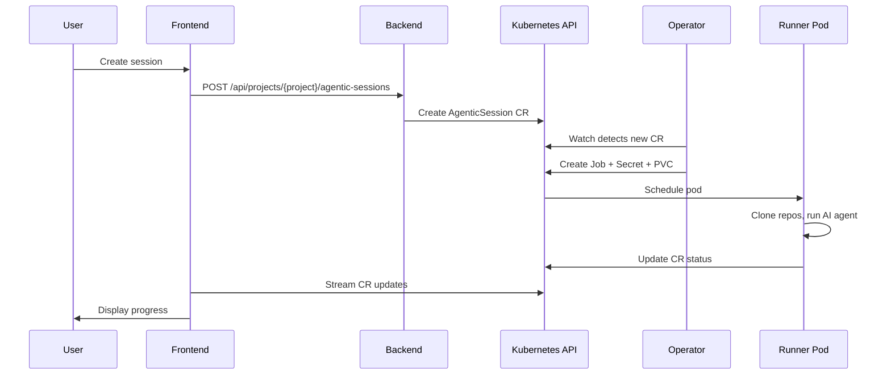

The platform is built on Kubernetes and uses Custom Resource Definitions (CRDs) as its primary data model. The core resource is the **AgenticSession** -- a custom resource that represents a single AI agent execution from creation through completion.

## Session flow

Every session follows this path through the system:

```
User creates session --> Backend creates CR --> Operator watches CR -->
Operator spawns Job --> Pod runs Claude CLI --> Results update CR --> UI displays progress
```



---

## Components

**Backend** -- Go REST API using Gin. Handles session CRUD, project management, and integration configuration. All operations use the requesting user's Kubernetes token, never the backend's own service account.

**Operator** -- Go controller built with controller-runtime. Watches AgenticSession CRDs and reconciles desired state by creating Jobs, Secrets, and PVCs with proper owner references.

**Runner** -- Polymorphic AG-UI server that runs inside each Job pod. Supports multiple AI provider bridges (Claude Agent SDK, Gemini CLI, LangGraph), streams output back to the CR status, and handles graceful shutdown on timeout or cancellation.

**Frontend** -- NextJS application with Shadcn UI components. Provides the session creation dialog, real-time chat interface, and workspace management. Uses React Query for server state.

**Public API** -- Stateless Go HTTP gateway. Proxies requests to the backend without direct Kubernetes access, intended for external integrations like the GitHub Action.

---

## Runner types

Runner types are configurable execution environments that determine which AI framework processes a session. Each runner type maps to a **bridge** -- a Python class that implements the `PlatformBridge` interface and adapts a specific AI framework to the platform's AG-UI event protocol.

### Available bridges

The runner resolves which bridge to load from the `RUNNER_TYPE` environment variable, defaulting to `claude-agent-sdk`:

| Bridge | Framework | Provider | Filesystem | MCP | Tracing | Session persistence |
|--------|-----------|----------|------------|-----|---------|---------------------|
| Claude Agent SDK | `claude-agent-sdk` | `anthropic` | Yes | Yes | Langfuse | Yes |
| Gemini CLI | `gemini-cli` | `google` | Yes | Yes | Langfuse | No |
| LangGraph | `langgraph` | configurable | No | No | LangSmith | No |

Each bridge declares its capabilities through a `FrameworkCapabilities` object. The frontend reads these capabilities from the `/capabilities` endpoint and hides UI panels that do not apply -- for example, the file browser is hidden for LangGraph sessions because that bridge sets `file_system=False`. Tracing values in the table reflect supported tracers; actual availability depends on whether tracing credentials (such as Langfuse keys) are configured in the deployment. A `ReplayBridge` also exists for testing and development but is not used in production.

### Model-to-runner mapping

The model registry (`models.json`) assigns a `provider` field to each model. When a user selects a model, the platform uses the provider to determine which runner type handles the session:

- **`anthropic`** models (Claude Sonnet, Opus, Haiku) route to the `claude-agent-sdk` runner.
- **`google`** models (Gemini Flash, Pro) route to the `gemini-cli` runner.

Some models are feature-gated and only appear when the corresponding feature flag is enabled.

### Capability differences

Bridges expose different subsets of agent features depending on framework support:

- **`agentic_chat`** -- Interactive multi-turn conversation (all bridges).
- **`human_in_the_loop`** -- Pause execution to collect user input (Claude, LangGraph).
- **`thinking`** -- Extended thinking / chain-of-thought display (Claude only).
- **`shared_state`** -- Share state between turns within a session (Claude, LangGraph).
- **`backend_tool_rendering`** -- Render tool calls and results server-side (Claude, Gemini).

### Runner type registry

Runner types are defined in the **agent registry**, a JSON file mounted from a ConfigMap at `/config/registry/agent-registry.json`. Each entry is an `AgentRuntimeSpec` that specifies the container image, port, environment variables, sandbox configuration, authentication requirements, and an optional feature gate.

The backend loads and caches the registry in memory (60-second TTL) and exposes it through `GET /api/projects/{project}/runner-types`. Entries with a `featureGate` are filtered out unless the corresponding flag is enabled, with support for workspace-scoped overrides via a separate ConfigMap. This design allows operators to add new runner types or gate experimental frameworks without redeploying the backend.

---

## Key architectural decisions

The project maintains [Architectural Decision Records](https://github.com/ambient-code/platform/tree/main/docs/internal/adr) for the full rationale behind each choice. The major decisions:

- **Kubernetes-native with CRDs** ([ADR-0001](https://github.com/ambient-code/platform/blob/main/docs/internal/adr/0001-kubernetes-native-architecture.md)) -- Sessions are Kubernetes custom resources, not database rows. The operator pattern handles lifecycle management, and standard Kubernetes tooling (RBAC, namespaces, resource quotas) provides multi-tenancy.

- **User token authentication** ([ADR-0002](https://github.com/ambient-code/platform/blob/main/docs/internal/adr/0002-user-token-authentication.md)) -- Every API operation that touches Kubernetes runs with the calling user's token. The backend never uses its own service account for user-initiated actions, ensuring Kubernetes RBAC is the single source of authorization.

- **Go for backend and operator, Python for runner** ([ADR-0004](https://github.com/ambient-code/platform/blob/main/docs/internal/adr/0004-go-backend-python-runner.md)) -- Go is the standard for Kubernetes controllers and provides strong performance for the API layer. The runner uses Python because the Claude Code SDK integration and tool orchestration benefit from Python's flexibility.

- **NextJS with Shadcn UI** ([ADR-0005](https://github.com/ambient-code/platform/blob/main/docs/internal/adr/0005-nextjs-shadcn-react-query.md)) -- Server-side rendering for initial page loads, client-side interactivity for the chat interface, and a consistent component library that follows accessibility standards.

---

## Further reading

- [Design documents](https://github.com/ambient-code/platform/tree/main/docs/internal/design) -- Session reconciliation, runner-operator contract, status redesign
- [Architecture diagrams](https://github.com/ambient-code/platform/tree/main/docs/internal/architecture/diagrams) -- Mermaid diagrams for system overview, session lifecycle, deployment stack
