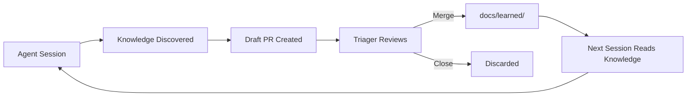

## What is Continuous Learning?

Every time an agent runs a session, it learns things -- conventions your codebase follows, mistakes to avoid, shortcuts that work. Continuous Learning (CL) is the pipeline that captures those discoveries and feeds them back into future sessions so the next agent starts smarter than the last one.

Here is how the loop works: during a session the agent notices something worth remembering -- maybe a pattern it figured out the hard way, or a mistake it made and corrected. It writes that knowledge as a small markdown file and submits it as a **draft pull request** against your repository. A human triager (that's you) reviews the PR, decides whether the knowledge is worth keeping, and merges or closes it. Once merged, the knowledge lands in `docs/learned/` on the default branch, where every future session picks it up automatically.

The result is a codebase that teaches its own agents. The more sessions you run, the more your agents know -- but only if someone curates what gets in.



## Your Role as a Triager

You review draft PRs labeled `continuous-learning`. Your job is not to block things -- it is to curate them. Think of yourself as an editor, not a gatekeeper.

The goal is **quality, not volume reduction**. If the knowledge is accurate and would help a future agent, merge it. If it is sloppy but the insight is real, clean it up and merge it. Only close PRs that are genuinely not useful.

You do not need deep expertise in every part of the codebase. If a learned file is about a component you are unfamiliar with, ask the person who owns that area. The PR is a draft -- there is no rush.

## What Draft PRs Look Like

Each PR adds one or more markdown files to `docs/learned/`. The directory is organized by knowledge type:

```
docs/learned/
  corrections/    # "Don't do X because Y"
  patterns/       # "Always do X because Y"
```

**Corrections** capture mistakes -- things an agent did wrong and should avoid next time. **Patterns** capture conventions -- things an agent discovered that should be repeated.

A typical learned file looks like this:

```markdown
---
title: Use GetK8sClientsForRequest for user-facing endpoints
type: pattern
source: session
confidence: high
tags: [backend, auth, go]
---

All user-facing API handlers must use `GetK8sClientsForRequest(c)` to
obtain Kubernetes clients scoped to the caller's token. Using the
backend service account bypasses RBAC and creates a privilege
escalation risk.

The only exception is internal health-check endpoints that do not
act on user data.
```

The frontmatter gives you context at a glance: what kind of knowledge it is, where it came from, and how confident the agent was.

## How to Review

When you open a CL draft PR, run through this checklist:

- **Is it project-specific and reusable?** The knowledge should apply across sessions, not just the one that generated it. "Always run `gofmt` before committing Go code" is reusable. "Fixed the typo in line 42 of today's PR" is not.
- **Is the title clear and the content actionable?** A future agent will read this. Could it act on it without additional context?
- **Is the type correct?** Corrections say "don't do X." Patterns say "do X." If the file is in the wrong directory, move it.
- **Would you want an agent to know this next time?** This is the simplest test. If the answer is yes, merge it.
- **Edit for clarity before merging.** You own the quality of what goes into the knowledge base. Fix awkward phrasing, remove noise, sharpen the advice.

## Common Triage Decisions

| Decision | Example | Why |
|----------|---------|-----|
| **Merge** | "Use `async def` for all FastAPI route handlers" | Clear, reusable, actionable |
| **Merge** | "Never log bearer tokens -- use `len(token)` instead" | Captures a real security convention |
| **Edit then merge** | "The thing with the K8s clients is you need the right one" | Good insight, poor wording -- fix it and merge |
| **Close** | "Used the wrong file path for today's task" | Too specific to one session |
| **Close** | Duplicate of an existing file in `docs/learned/patterns/` | Already covered |
| **Close** | "Go is better than Python for this" | Opinion, not actionable convention |

## How Approved Knowledge Works

Once you merge a CL pull request, here is what happens:

1. The learned file lands on the default branch in `docs/learned/`.
2. When the next session starts, the runner reads all files in `docs/learned/` during initialization.
3. The knowledge is injected into the agent's system prompt under a `## Project Memory` section.
4. The agent uses this knowledge throughout the session. When it applies a learned convention, it cites the source with a `[memory:PM-XXX]` badge in its response.

This means your triage decisions have a direct, visible effect. Merged knowledge shows up in agent responses. Closed PRs disappear. You control what your agents remember.

## Where Knowledge Comes From

Learned files arrive through three paths:

- **Agent-suggested** -- During a session, the agent calls the `suggest_memory` tool when it discovers something worth remembering. This is the most common source.
- **Insight extraction** -- After a session completes, an automated step reviews the session transcript and extracts reusable knowledge the agent did not explicitly flag.
- **Manual entry** -- Team members can add knowledge directly using the "Add Memory" button in the UI. Use this when you know something the agents keep getting wrong and you want to short-circuit the discovery process.

All three paths produce the same output: a draft PR with markdown files in `docs/learned/`.

## Tips for Effective Triage

- **Review regularly.** Weekly is fine. CL draft PRs are not urgent -- they sit as drafts until you get to them. But letting them pile up makes the queue feel worse than it is.
- **Merge early, archive later.** False positives (knowledge that turns out to be unhelpful) are cheap to remove. Lost knowledge (insights you closed that would have helped) is expensive because the agent has to rediscover it. When in doubt, merge.
- **Watch for drift.** Over time, corrections can contradict each other -- especially if the codebase evolves. If you see a new correction that conflicts with an existing one, resolve the conflict. Delete or update the stale file.
- **Don't over-edit.** The agent wrote the knowledge in a specific context. Preserve the useful signal even if the prose is not perfect. A rough but accurate description beats a polished but vague one.
- **Check the tags.** Tags help future agents find relevant knowledge faster. Make sure they are accurate -- wrong tags are worse than no tags.
- **Look for patterns in corrections.** If agents keep making the same mistake, the existing correction might not be clear enough. Rewrite it rather than merging a second one that says the same thing differently.
