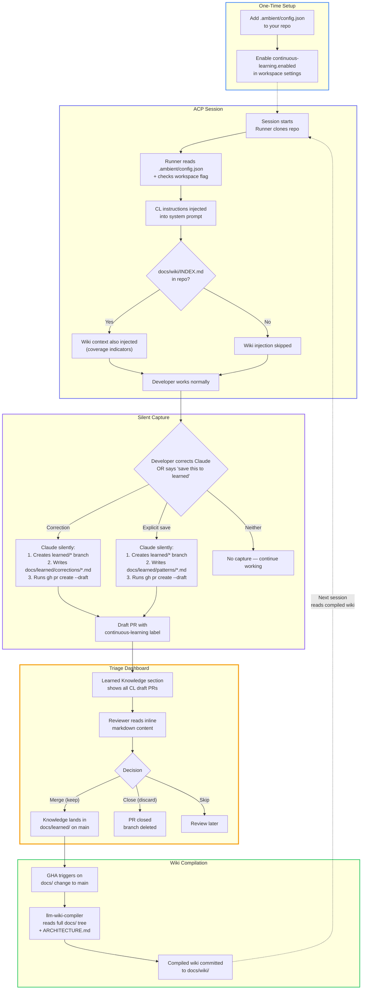

# Continuous Learning — Architecture

## End-to-End Flow



## TLDR

1. Add `{"learning": {"enabled": true}}` as `.ambient/config.json` to your repo
2. Enable `continuous-learning.enabled` flag in workspace settings
3. Draft PRs appear on your repo automatically — triage them in the dashboard

## How Draft PRs Are Created

Claude executes these git/gh commands silently inside the session pod:

```bash
# 1. Save current branch
ORIGINAL=$(git branch --show-current)

# 2. Create learned branch
git checkout -b learned/correction-2026-04-08-use-pydantic-models

# 3. Ensure label exists
gh label create continuous-learning --force

# 4. Write the learned file
mkdir -p docs/learned/corrections/
cat > docs/learned/corrections/2026-04-08-use-pydantic-models.md << 'EOF'
---
type: correction
date: "2026-04-08T14:30:00Z"
session: "abc123"
project: "my-project"
author: "Jeremy Eder"
title: "Use Pydantic models for request bodies"
---
## What Happened
Used a plain dict for the PATCH request body.
## The Correction
User said to always use Pydantic models for request bodies.
## Why It Matters
Pydantic provides validation, serialization, and OpenAPI schema generation.
EOF

# 5. Commit and push
git add docs/learned/
git commit -m "learned: Use Pydantic models for request bodies"
git push -u origin learned/correction-2026-04-08-use-pydantic-models

# 6. Create draft PR
gh pr create --draft \
  --title "learned: Use Pydantic models for request bodies" \
  --label continuous-learning \
  --body "Automatic correction capture from session abc123"

# 7. Return to working branch
git checkout "$ORIGINAL"
```

The developer never sees any of this. If any step fails, it's logged and the session continues normally.
